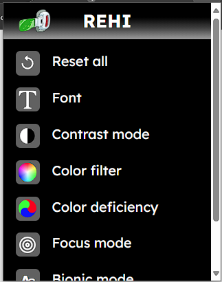

# REHI



# Bắt đầu
Clone repo về máy
```
git clone https://github.com/EttoNekko/REHI/
```

Cài đặt các thư viện cần thiết
```
npm install
```

Build ra extension
```
npm run build
```

# Cách sử dụng
Tải extension tại 
[](https://github.com/EttoNekko/REHI/releases)

Cài đặt extension
- Mở trình duyệt Chrome
- Truy cập vào `chrome://extensions/`
- Bật chế độ `Developer mode`
- Kéo thả file extension đã tải vào trang `chrome://extensions/`
